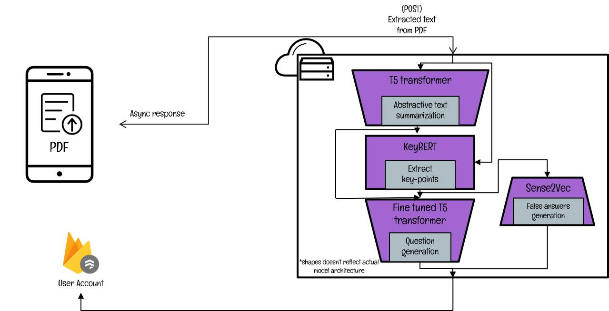
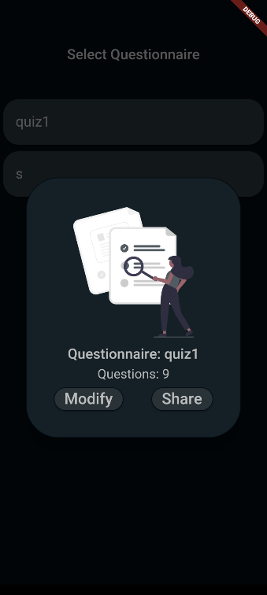
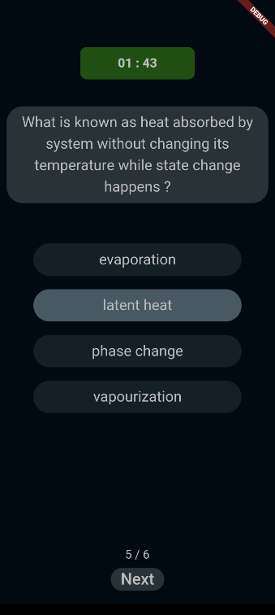
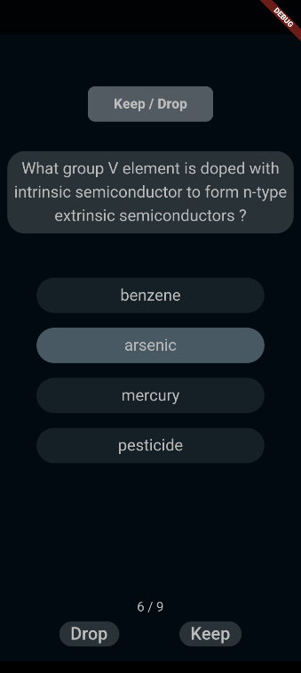

<h1 align="center">Welcome to quizzzy 👋</h1>

<p>
  <a href="#" target="_blank">
    
  </a>
  <a href="https://codecov.io/gh/Karthick47v2/quizzzy" > 
     
 </a>
</p>

Quizzzy, an AI assisted educational mobile application developed for high school students and officials to
automatically generate MCQ questions from existing textbooks with the help of AI. System takes all the tedious
work and makes the manual work quick and effective. The application is very useful for high schoolers to self-
evaluate and high school officials to be used as assessment tool. This application will use the PDF version of
textbooks or study material to compile questionnaire where PDF should contain text materials (No scanned
PDFs). This application is for 2 set of users, students and teachers. Every user can generate, attempt, delete
questionnaires while only teachers can share generated questionnaires. By this application the user will come
to know about his/her level (if student) or his/her student’s level (if teacher) and can learn / teach additional
knowledge.

Supporting repositories

- Back-end -> [quizzzy-backend](https://github.com/Karthick47v2/quizzzy-backend)
- Model training -> [question-generator](https://github.com/Karthick47v2/question-generator)

Below shown high-level diagram represents the whole work flow,



Screenshots:

<p>
  
  
  
</p>

<p>
  
  
  
</p>

<p>
  
  
  
</p>

## Prerequisites

- Flutter (>=3.0.5)
- Firebase

## Install

```sh
$ cd quizzzy
$ flutter pub get
```

## Usage

\*Tested on Android device

To run,

```sh
$ cd quizzzy
$ flutter run
```

To build,

```sh
$ cd quizzzy
$ flutter build apk
```

## Run tests

You can also view the code coverage report [here](https://app.codecov.io/gh/Karthick47v2/quizzzy)

```sh
$ cd quizzzy
$ flutter test
```

## Author

👤 **Karthick T. Sharma**

- Github: [@Karthick47v2](https://github.com/Karthick47v2)
- LinkedIn: [@Karthick47](https://linkedin.com/in/Karthick47)

## 🤝 Contributing

Contributions, issues and feature requests are welcome!<br />Feel free to check [issues page](https://github.com/Karthick47v2/quizzzy/issues).

## Show your support

Give a ⭐️ if this project helped you!
